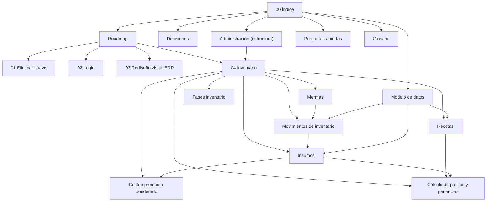

# Byeburger — Plan (Índice)

Mapa de trabajo del POS Byeburger. Cada nota está enlazada; abre este vault en Obsidian y usa la vista de grafo o [[Mapa.canvas|el Canvas]] para ver todo conectado.

## Mapa

## Tareas

1. [[01 - Eliminar suave (Usuarios y Sucursales)]]
2. [[02 - Login]]
3. [[03 - Rediseño visual ERP]]
4. [[04 - Inventario]]

## Referencia

- [[Roadmap]] — orden y estado
- [[Decisiones]] — decisiones cerradas
- [[Administración (estructura)]] — cómo se organiza el sidebar de `/admin`
- [[Modelo de datos]] — tablas actuales y nuevas
- [[Preguntas abiertas]] — lo que falta confirmar
- [[Glosario]] — términos

## Contexto del repo

- Backend: FastAPI + SQLAlchemy (SQL crudo con `text()`), Postgres. Routers en `Backend/app/routers/`.
- Frontend: React + TS + Vite. POS en `Frontend/src/pages/PosPage.tsx`, admin en `Frontend/src/pages/admin/`.
- Auth: JWT, roles `ADMIN=1`, `SUPERVISOR=2`, `CAJERO=3` (`Frontend/src/api/auth.ts`, `Backend/app/rbac.py`).
- Migraciones: Alembic en `alembic/versions/` (solo 2 hasta ahora).
